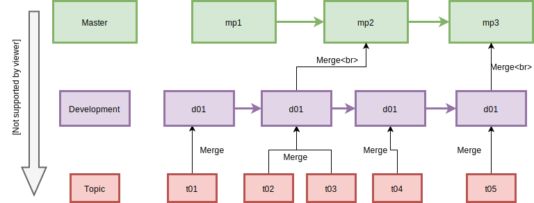

# movie-analyst-api

API for the movie analyst application of the jenkins ramp up

Bear in mind that you would need to pass the connection data to the application for it to work, check the code, the environment variables are there :D

## Branching strategy

The branching strategy is based on levels of expected stability, with the master branch at the top which is expected to be production ready stable, down to the topic branch which needs not be stable at all times. Once a branch reaches certain level of stability then it will merge upwards until it reaches the master branch.

A diagram of this model can be seen below:

## Attributions

Application developed based on this post <https://scotch.io/tutorials/building-and-securing-a-modern-backend-api>
